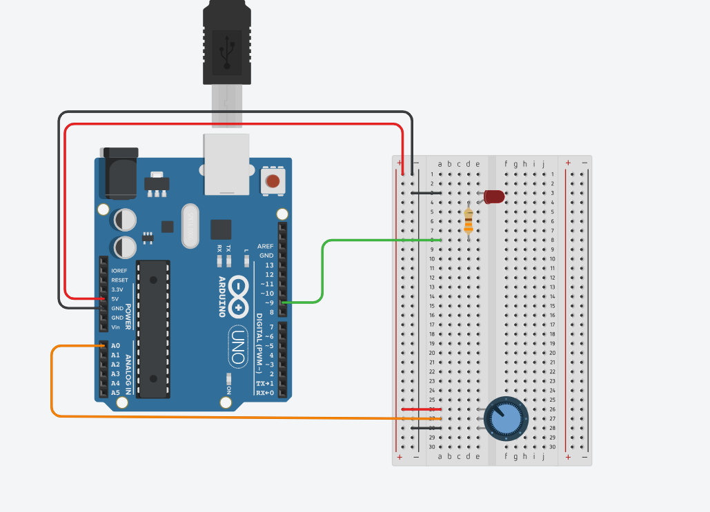

# ArduinoPotentiometerLED

### 가변저항의 값에 따라서 LED 밝기 조절
- 가변저항의 값이 클 수록 LED가 밝아집니다.
- 가변저항은 analog입력으로 analog입력은 10비트 (0 ~ 1023)입니다.
- analog의 출력은 8비트(0 ~ 255)입니다. (255 넘어가면 오버플로우로 0부터 다시 올라갑니다.)

  

